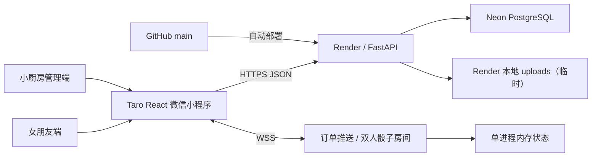

# 项目交接与首次完整审计

> 当前交付基线：V2.2 开发版本 `2.2.0`，日期 2026-08-09。历史审计基线为 1.0.19。

## 1. 产品定位

项目不是面向餐厅顾客的商业点餐系统，而是一个“情侣私厨协作工具”：

- 女朋友端负责表达“想吃什么、几点吃、有什么备注”和用爱心反馈体验。
- 小厨房管理端负责接单、制作状态、菜单维护和口味复盘。
- 转盘与骰子属于情侣互动层，不应打断点菜主流程。

核心产品承诺应保持简单：打开快、选择快、提交可靠、状态看得懂、完成后愿意评价。

## 2. 当前运行事实

| 项目 | 当前状态 |
| --- | --- |
| 小程序技术 | Taro 4 + React 18 |
| 小程序版本 | 2.2.0（待上传/体验验收） |
| 后端 | FastAPI + SQLAlchemy 2 |
| 生产数据库 | Neon PostgreSQL |
| 本地数据库 | SQLite 回退 |
| 生产 API | `https://girlfriend-menu-api.onrender.com` |
| 2026-08-08 健康检查 | `/api/health` 正常；`/api/ready` 返回 PostgreSQL ready |
| 线上启用菜品 | 19 道 |
| 后端自动测试 | 7 项通过 |
| 数据库迁移 | Alembic `20260809_03`，全新 SQLite 连续升级验证通过 |
| 小程序构建 | `npm run build:weapp` 通过 |
| 正式发布状态 | 代码无法证明；需在微信公众平台“版本管理”确认 |

## 3. 系统架构



重要边界：

- 用户端与管理端都在同一个微信小程序包里。
- HTTP 数据通过 `miniprogram/src/api/index.js` 访问，实时能力通过两个 WebSocket 客户端访问。
- 订单、菜品、评价、情侣积分和统计持久化到 PostgreSQL。
- 实时连接和骰子房间不入库，只保存在后端进程内存。
- 旧 React/Vite 网页端已退休，不应再作为功能入口。

## 4. 页面地图

| 页面 | 路径 | 作用 |
| --- | --- | --- |
| 首页/邀请码 | `pages/index/index` | 邀请码、智能推荐、最近常点、Top 5、今日菜单 |
| 菜单 | `pages/menu/index` | 搜索、分类、收藏、加入清单 |
| 一起玩 | `pages/games/index` | 动态游戏大厅、开放状态、转盘和大话骰入口 |
| 我们 | `pages/couple/index` | 默契值、本月互动、共同成长和低强调管理入口 |
| 积分明细 | `pages/couple/score` | 按日期查看积分来源 |
| 共同记录 | `pages/couple/records` | 第一次点餐、完成次数、游戏次数和最爱菜品 |
| 成就 | `pages/couple/achievements` | 根据已有业务数据派生的成长成就 |
| 菜品详情 | `pages/detail/index` | 菜品信息与加入清单 |
| 点菜清单 | `pages/cart/index` | 数量、备注、时间、提交订单 |
| 我的点菜单 | `pages/my-orders/index` | 当前设备的历史订单 |
| 订单详情 | `pages/order-detail/index` | 状态、明细、爱心评价 |
| 自定义转盘 | `pages/wheel/index` | 2～12 个本地选项的随机转盘 |
| 单机大话骰 | `pages/dice/index` | 原生 WebGL 骰子、AI 对局 |
| 双人大话骰 | `pages/dice-online/index` | 房间、实时叫骰、开盅、计分 |
| 管理登录 | `pages/admin-login/index` | 管理密码登录 |
| 管理总览 | `pages/admin-dashboard/index` | 订单、菜品、统计入口 |
| 管理订单 | `pages/admin-orders/index` | 全部订单、实时刷新、改状态 |
| 菜品管理 | `pages/admin-dishes/index` | 新增、编辑、下架、图片上传 |
| 管理统计 | `pages/admin-stats/index` | 订单、排行、评分和评价记录 |

## 5. 本地状态与身份

| key | 内容 | 清缓存影响 |
| --- | --- | --- |
| `gf_invite_passed` | 是否通过邀请码 | 需要重新输入邀请码 |
| `gf_customer_id` | 当前设备的匿名客户标识 | “我的点菜单”无法自动找回旧订单 |
| `gf_menu_cart` | 未提交的点菜清单 | 清单丢失 |
| `gf_repeat_order_draft` | 再次点单的来源和备注 | 草稿来源信息丢失 |
| `gf_admin_token` | 管理登录令牌 | 需要重新登录管理端 |
| `gf_wheel_items` | 自定义转盘选项 | 转盘恢复默认值 |

`customer_id` 不是微信账号，也不是 OpenID。它只解决最小版本里“同一台设备再次打开还能找到订单”的需求。

## 6. 数据模型

### dishes

| 字段 | 类型/约束 | 说明 |
| --- | --- | --- |
| `id` | Integer PK | 菜品编号 |
| `name` | String(100), required | 菜名 |
| `description` | Text | 描述 |
| `category` | String(50), indexed | 分类 |
| `price` | Float | 展示价格 |
| `image_url` | String(500) | 网络图片或 `/uploads/...` |
| `cook_time` | Integer, nullable | 制作时间（分钟） |
| `difficulty` | Integer, nullable | 难度 1～5 |
| `spicy_level` | Integer, nullable | 辣度 0～3 |
| `tags` | JSON, nullable | 最多 10 个展示标签 |
| `is_active` | Boolean, indexed | 软下架标记 |
| `created_at` | DateTime | 创建时间 |

### orders

| 字段 | 类型/约束 | 说明 |
| --- | --- | --- |
| `id` | Integer PK | 订单编号 |
| `status` | String(20), indexed | 五种订单状态之一 |
| `note` | Text | 备注 |
| `desired_time` | String(50) | 希望用餐时间，当前不是结构化时间 |
| `customer_id` | String(100), nullable, indexed | 设备匿名标识，兼容无标识旧订单 |
| `source_order_id` | FK orders, nullable, indexed | “再做一次”的来源订单 |
| `created_at` | DateTime, indexed | 提交时间 |

### order_items

| 字段 | 类型/约束 | 说明 |
| --- | --- | --- |
| `id` | Integer PK | 明细编号 |
| `order_id` | FK orders, indexed | 所属订单 |
| `dish_id` | FK dishes | 原菜品编号 |
| `dish_name` | String(100) | 下单时菜名快照 |
| `price` | Float | 下单时价格快照 |
| `quantity` | Integer | 数量 |

### reviews

| 字段 | 类型/约束 | 说明 |
| --- | --- | --- |
| `id` | Integer PK | 评价编号 |
| `order_id` | FK orders, unique | 一个订单只能评价一次 |
| `rating` | Integer | 1～5 颗爱心 |
| `want_again` | String(20) | 想吃 / 一般 / 暂时不想 |
| `comment` | Text | 可选建议 |
| `created_at` | DateTime | 评价时间 |

### favorite_dishes

| 字段 | 类型/约束 | 说明 |
| --- | --- | --- |
| `id` | Integer PK | 收藏编号 |
| `customer_id` | String(100), indexed | 当前设备匿名标识 |
| `dish_id` | FK dishes, indexed | 收藏菜品 |
| `created_at` | DateTime | 收藏时间 |

`customer_id + dish_id` 唯一，同一设备不会重复收藏。

### games / game_rooms

- `games`：游戏名称、文字图标、唯一 `type`、`available/coming_soon/maintenance` 状态。
- `game_rooms`：唯一房间码、游戏类型、创建者、`waiting/playing/finished` 状态、最大人数和创建时间。
- 房间元数据持久化，实时玩法状态仍在单进程内存中。

### love_scores

- 记录 `customer_id`、正积分、固定行为类型、描述、关联业务编号和发生时间。
- `customer_id + type + related_id` 唯一，使订单完成、五星评价和再次点单的自动奖励保持幂等。
- 当前自动规则：订单完成 +10、五星评价 +5、通过“再做一次”提交新订单 +2。
- 默契值按近 30 天互动、共同经历与满意反馈加权计算，不直接等于累计积分。

关系：订单拥有多个明细和最多一条评价。情侣积分通过 `related_id` 保留业务来源但不建立强外键，以兼容订单、游戏和特殊事件。菜品下架采用 `is_active = false`，不会破坏历史订单快照。

## 7. API 清单

公共 HTTP：

| 方法 | 路径 | 用途 |
| --- | --- | --- |
| GET | `/api/health` | 服务存活检查 |
| GET | `/api/ready` | 数据库就绪检查 |
| GET | `/api/dishes` | 菜品列表/分类筛选 |
| GET | `/api/dishes/{id}` | 菜品详情 |
| GET | `/api/games` | 游戏大厅目录与开放状态 |
| POST | `/api/games/rooms` | 为开放游戏创建统一房间 |
| GET | `/api/games/rooms/{room_code}` | 查询房间元数据和状态 |
| GET | `/api/favorites` | 当前设备收藏（`X-Customer-Id`） |
| POST | `/api/favorites/{dish_id}` | 收藏菜品（`X-Customer-Id`） |
| DELETE | `/api/favorites/{dish_id}` | 取消收藏（`X-Customer-Id`） |
| POST | `/api/orders` | 提交订单 |
| POST | `/api/orders/repeat/{id}` | 返回可编辑的再次点单草稿（`X-Customer-Id`） |
| GET | `/api/orders/my/{customer_id}` | 当前设备历史订单 |
| GET | `/api/orders/{id}` | 订单详情 |
| POST | `/api/orders/{id}/review` | 提交评价 |
| GET | `/api/orders/{id}/review` | 查询评价 |
| GET | `/api/stats/favorite-ranking` | 当前设备喜欢排行（`X-Customer-Id`） |
| GET | `/api/couple/score` | 默契值、本月统计和计算分项（`X-Customer-Id`） |
| GET | `/api/couple/score/history` | 当前设备积分流水（`X-Customer-Id`） |
| POST | `/api/games/dice/rooms` | 创建双人骰子房间（校验邀请码） |

管理 HTTP（Bearer token）：

| 方法 | 路径 | 用途 |
| --- | --- | --- |
| POST | `/api/admin/login` | 密码 + 邀请码换取令牌 |
| POST | `/api/upload/image` | 上传最多 5MB 的 jpg/jpeg/png/webp |
| POST | `/api/dishes` | 新增菜品 |
| PUT | `/api/dishes/{id}` | 编辑菜品 |
| DELETE | `/api/dishes/{id}` | 软下架菜品 |
| GET | `/api/orders` | 全部订单 |
| PATCH | `/api/orders/{id}/status` | 修改订单状态 |
| GET | `/api/stats/summary` | 总订单、已完成、最近下单时间 |
| GET | `/api/stats/dishes` | 每道菜点单次数和最近时间 |
| GET | `/api/stats/recent` | 最近 10 个订单 |
| POST | `/api/couple/score/add` | 为指定设备补录积分（同时要求 `X-Customer-Id`） |

WebSocket：

| 路径 | 用途 |
| --- | --- |
| `/ws/admin/orders` | 管理端新订单、状态和评价事件 |
| `/ws/games/dice/{room_code}` | 双人骰子房间状态同步 |
| `/ws/game/{room_code}` | V2.1 统一游戏房间协议（当前已接入大话骰） |

## 8. 关键业务状态

订单状态固定为：

```text
待接单 → 已接单 → 制作中 → 已完成
                   ↘ 暂时做不了
```

当前后端只校验状态值，不限制状态跳转顺序；管理端可以从任意状态切到任意合法状态。

评价规则：

- 只有“已完成”订单可以评价。
- 数据库唯一约束和业务检查共同防止重复评价。
- 当前公共评价接口没有验证评价人是否拥有该订单。

双人骰子状态：

```text
waiting → rolling → bidding → finished → rematch/rolling
```

每个房间固定两人，每人 5 颗骰子；叫非 1 点时，1 作为万能点。房间与积分只存在后端内存中。

## 9. 当前优势

1. 点菜主链路完整：浏览、清单、提交、状态、历史、评价已经闭环。
2. 管理端内置小程序，个人主体无法配置 web-view 业务域名时仍可使用。
3. 菜品软下架和订单快照保护历史数据。
4. SQLite 与 PostgreSQL 双环境可运行，旧库补字段是幂等的。
5. 生产环境变量没有提交到仓库。
6. 已有 CI、后端集成测试和微信开发者工具冒烟脚本。
7. 网络错误、Render 冷启动、图片失败和页面渲染异常都有基础回退提示。

## 10. 风险与技术债

### P0：上线前优先处理

1. 邀请码硬编码在小程序包中，只是入口体验，不能视为秘密。
2. 订单详情与评价接口使用可枚举订单号，未校验 `customer_id` 或订单访问凭证；知道订单号的人理论上可以查看或评价。
3. 双人骰子点数由客户端生成后提交，修改过的客户端可以作弊；娱乐用途可接受，竞技用途不可靠。

### P1：稳定性与维护

1. 双人房间与订单 WebSocket 连接只在单进程内存，Render 重启、多实例或扩容会中断房间。
2. 房间没有独立 TTL 清理任务；目前依赖最后一个连接离开后删除。
3. Render 本地上传文件会随重部署或实例替换丢失。
4. 旧库仍保留启动时幂等兼容检查；正式版本已经使用 Alembic，后续结构变化必须继续新增迁移版本。
5. 管理端全量读取订单，订单增多后需要分页。
6. API 地址固定写在源码里，开发/预发布/生产环境切换不够安全。
7. 管理 token 是环境变量派生的固定值，无有效期、设备管理或主动撤销机制。

### P2：体验与产品结构

1. 首页同时承载菜单、转盘、单机游戏、双人游戏和管理入口，首屏重点开始分散。
2. 管理入口与女朋友端工具并列，角色感不够清晰。
3. 已有五项底部主导航；非 Tab 页面仍混用 `navigateTo/redirectTo/reLaunch`，需继续统一返回策略。
4. 分类、历史和统计缺少搜索、分页和筛选。
5. 价格在私厨场景是否有价值尚未验证，可考虑改成“难度/准备时间/辣度”。
6. `desired_time` 是自由文本，无法可靠排序或做提醒。

## 11. UI/UX 方向

建议保留“温馨、克制、私厨”的品牌，不继续堆叠更多粉色渐变。

信息架构建议：

- 首页第一屏只放“今天想吃什么”、最近常点和分类。
- 主导航固定为“首页 / 菜单 / 点菜单 / 一起玩 / 我们”。
- 转盘和两种骰子统一收进“一起玩”，避免挤压点菜主任务。
- 管理入口位于“我们”底部，用低强调入口进入密码页。
- 订单状态用统一时间线，不只显示一句状态文案。
- 菜品卡片增加“最近点过”“她喜欢”“制作时间”等更贴合私厨的信号。

视觉规则建议：

- 正文字号不低于 24rpx，次要文字不低于 22rpx。
- 所有点击区域最小高度 88rpx。
- 主色只用于关键动作和状态，不同时在每张卡片上使用。
- 统一圆角层级：按钮 24rpx、卡片 28rpx、大容器 36rpx。
- 深色骰子游戏允许成为独立视觉主题，但返回点菜区后恢复统一浅色系统。
- 对比度、动态字体、长菜名、网络慢和无图片状态必须纳入真机验收。

## 12. 建议路线图

### 1.0.20：安全与可靠性修复

- 为订单创建不可枚举访问凭证，历史与评价接口校验凭证或设备身份。
- API 地址按开发/生产构建环境管理。
- 图片迁移到对象存储。
- 实时房间增加 TTL、断线重连提示和服务重启提示。
- 增加订单状态转换测试、图片验证测试和权限测试。

### 1.1：点菜体验升级

- 重做首页信息层级与底部导航。
- 最近常点、收藏、再次点单。
- 辣度、忌口、预计制作时间。
- 希望用餐时间改为日期时间选择器。
- 订单状态时间线与状态更新时间。

### 1.2：小厨房协作

- 根据订单自动生成采购清单。
- 菜品可用/今日售罄开关。
- 微信订阅消息：新订单、已接单、可以开吃。
- 管理端分页、筛选、导出和数据库正式迁移。

### 2.0：智能私厨（需验证需求后再做）

- 基于历史、评分、忌口和天气做规则推荐。
- 心情选择与轻量推荐。
- 月度口味报告和共同回忆，不优先做复杂餐厅 ERP。

## 13. 下一位开发者的工作原则

1. 不破坏点菜、历史、评价和管理端主链路。
2. 修改 API 时同时更新 Pydantic schema、前端调用、测试和本文档。
3. 新功能先确认属于“点菜主流程”“小厨房管理”还是“情侣互动”，不要继续堆在首页。
4. 不在仓库、截图、日志或压缩包中放生产数据库密码、管理密码和密钥。
5. 每次发布至少通过后端测试、小程序生产构建和真机核心验收。

## 14. 截图采集清单

为了让产品、UI 或下一位 AI 看到真实体验，建议从同一台真机、同一版本采集：

用户端：

1. 邀请码页
2. 菜单首页与分类
3. 菜品详情
4. 点菜清单
5. 我的点菜单
6. 订单详情与评价
7. 转盘
8. 单机骰子开盅前/后
9. 双人房间与计分板

管理端：

1. 管理登录
2. 管理总览
3. 实时订单
4. 菜品管理
5. 点菜统计

截图中不要出现生产密码、Neon 连接串或管理 token。
